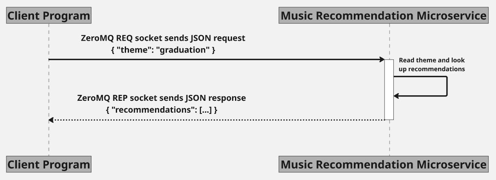

# Music Recommendation Microservice

## Overview

This microservice provides music recommendations based on a requested theme. Communication is handled using ZeroMQ with a REQ/REP pattern and JSON messages.

---

## Setup Instructions

### Install Dependencies

```bash
pip install pyzmq
```

### Start the Microservice

```bash
python music_microservice.py
```

The microservice will start listening on:

```text
tcp://localhost:5555
```

Expected output:

```text
Music Recommendation Microservice is running...
```

---

# Communication Contract

## REQUESTING DATA

To request music recommendations, connect a ZeroMQ REQ socket to:

```text
tcp://localhost:5555
```

Send a JSON object containing a theme.

### Example Request

```python
import zmq

context = zmq.Context()

socket = context.socket(zmq.REQ)
socket.connect("tcp://localhost:5555")

request = {
    "theme": "graduation"
}

socket.send_json(request)
```

### Request Format

```json
{
    "theme": "graduation"
}
```

Supported themes:

* graduation
* travel
* birthday

Any unsupported theme will return default recommendations.

---

## RECEIVING DATA

After sending a request, receive the response using:

```python
response = socket.recv_json()
```

### Example Response

```json
{
    "recommendations": [
        "Celebration",
        "Achievement",
        "New Beginnings"
    ]
}
```

### Response Format

```json
{
    "recommendations": [
        "song1",
        "song2",
        "song3"
    ]
}
```

### Example Complete Client

```python
import zmq

context = zmq.Context()

socket = context.socket(zmq.REQ)
socket.connect("tcp://localhost:5555")

request = {
    "theme": "graduation"
}

socket.send_json(request)

response = socket.recv_json()

print(response)
```

---

## UML Diagram




## Error Handling

If a theme is not found in the music database, the microservice returns default recommendations.

Example request:

```json
{
    "theme": "sports"
}
```

Example response:

```json
{
    "recommendations": [
        "Default Track 1",
        "Default Track 2"
    ]
}
```
